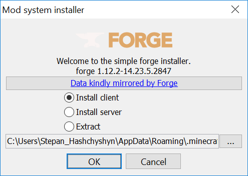
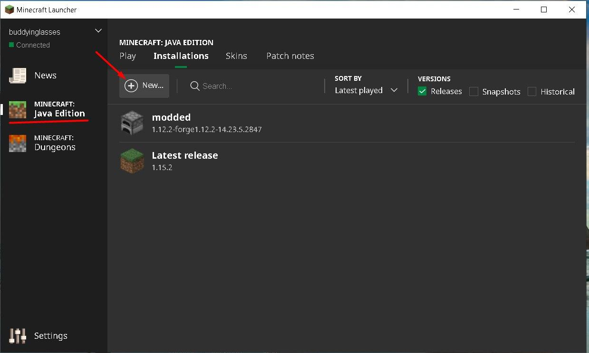
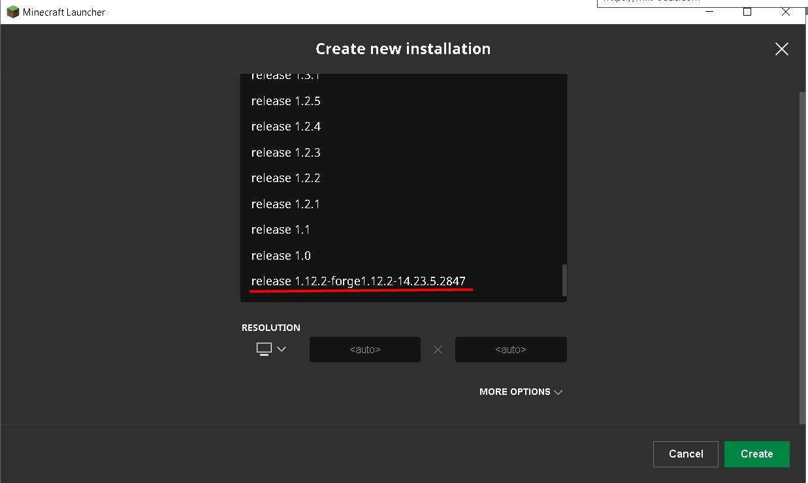

# Сборка клиента

### Покупка Minecraft Java Edition

Купить Minecraft можно только на  https://www.minecraft.net. Покупая лицензию вы по сути покупаете аккаунт (имя которого между прочим и будет вашим именем в игре, так что выбирайте внимательно). Важно приобрести именно Java Edition, потому что другие (Bedrock) не поддерживают модификации и не смогут подключиться к серверу. После покупки установите игру.

### Конструирование клиента с модами

1. скачать [forge-1.12.2-14.23.5.2847-installer-win.exe](http://files.block33.net/forge-1.12.2-14.23.5.2847-installer-win.exe ), запустить и кликнуть OK.

   

2. скачать [архив с модами]( http://files.block33.net/mods.zip ), распаковать в каталог с майнкрафтом (обычно это что то вроде C:\Users\Stepan_Hashchyshyn\AppData\Roaming\\.minecraft). В результате в папке .minecraft должна появиться папка "mods" c файлами .jar внутри.

3. создать дополнительную сборку в клиенте. Здесь же можно задать параметры для оперативной памяти чтобы улучшить производительность.

   

   

4. запустить Minecraft и увидеть характерные надписи в нижнем левом углу сигнализирующие о наличии модов.

   

При проблемах во время конструирования клиента, есть чуть более развернутый процесс описанный [здесь]( https://minecraft.gamepedia.com/Mods/Forge )

В случае нерешаемых проблем можно обратиться в [B33 telegram group]()

### Подключение к серверу

1. запустить игру
2. перейти в Multiplayer
3. кликнуть Add Server
4. указать в поле Server Address - mc.block33.net
5. кликнуть Done
6. кликнуть Refresh, потому что иногда сервер не определяется сам
7. повторять попытки подключения до успеха

В случае проблем можно обратиться в [B33 telegram group]()

Замечание: если после подключения черный экран - вероятно это просто ночь